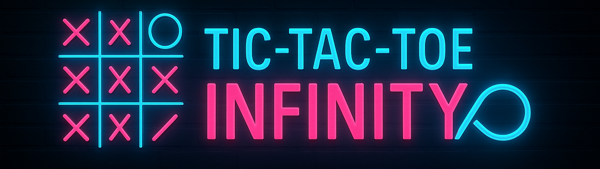

# 🛰️ Tic-Tac-Toe: Infinity

> Real-time cyberpunk multiplayer Tic-Tac-Toe with a twist — only **3 active marks** per player.

 <!-- replace with your actual banner path if different -->

<!-- <p align="center">
  
</p> -->

---

## 🔰 Badges

<!-- Replace `yourname` and `tic-tac-toe-infinity` with your actual GitHub user/repo -->

[](https://tictactoe-infinity.onrender.com/)
[](https://github.com/MayurVadhadiya360/TicTacToe-Infinity/blob/main/LICENSE)
<!-- [](https://github.com/MayurVadhadiya360/TicTacToe-Infinity/actions) -->


---

## ✨ Overview

**Tic-Tac-Toe: Infinity** is a neon-lit, cyberpunk re-imagining of classic Tic-Tac-Toe:

- ⚡ Real-time multiplayer using **FastAPI WebSockets**
- ♻️ A unique rule: each player can have **max 3 marks** on the board  
  ↳ placing a 4th move removes the **earliest** mark  
- 🌐 Matchmaking: create games, join by ID, or queue for a random match
- 🎨 Fully themed cyber UI: neon board, holo player cards, particles, scan lines
- 🔊 Sound effects: clicks, turn change, game start
- 📱 Responsive for desktop and mobile
- 🚀 Production-ready backend served on **Render**

---

## 🧩 Gameplay Rules

### Board Representation

- `-1` → empty cell  
- `0` → Player X  
- `1` → Player O  

### Turn Rules

- Players alternate turns.
- You can play on any empty cell when it’s your turn.
- Game state is synchronized in real time between both players.

### 3-Mark Limit (Infinity Rule)

Each player may have **at most 3 active marks** on the board at any time:

1. For the 1st, 2nd, and 3rd moves → marks are placed normally.
2. On the 4th move and beyond →  
   - The **oldest** mark of that player is removed.
   - The new mark is placed in the selected cell.

This creates a constantly shifting, more tactical game than classic Tic-Tac-Toe.

### Win Condition

A player wins if they have **three of their marks in a line** (with the current 3 marks):
- 3 in a row horizontally  
- 3 in a column vertically  
- 3 diagonally

---

## 🎮 Features

### Multiplayer & Matchmaking

- **Create Game**  
  Generate a new game with a unique Game ID.
- **Join Game**  
  Enter a Game ID shared by a friend.
- **Random Match**  
  Join a matchmaking pool; when another player queues, you are paired.
- **Guest Mode**  
  If no player ID exists, a guest ID is generated and stored locally.

### Persistent Player Identity

- Player IDs are stored in `localStorage` so your identity persists across sessions.
<!-- - Guests can share their ID to play again or identify themselves in logs. -->

### Cyberpunk UI

- Neon Tic-Tac-Toe board with glow and scan effects
- Player showdown card:
  - Blue/cyan for **YOU**
  - Pink/red for **OPPONENT**
  - Hologram rings & scan bars around the active player
- Animated dividers, particle effects, and holo waiting screens
- Responsive layout that adapts to mobile/desktop

### Audio & Feedback

- UI click sound on actions
- Turn-change sound
- Game start sound when both players are connected
- (Optional) You can mute or extend sound effects via the audio hook

---

## 🧱 Technology Stack

### Frontend

- **React** + **TypeScript**
- **Vite** for fast bundling & dev server
- Custom hooks for:
  - WebSocket connection
  - Game state sync
  - Audio playback
- Neon / cyberpunk theming via a handcrafted `styles.css`
- Responsive design using `clamp`, `flex`, and `grid`

### Backend

- **FastAPI**
- **WebSockets** for real-time communication
- REST endpoints for:
  - Creating games
  - Matchmaking info
- Custom **GameManager** for:
  - Tracking games and players
  - Applying the 3-mark rule
  - Detecting wins
  - **MatchMaker** for random match queues
- FastAPI serving the React production build in production

---

## 🧪 Local Development

### 1️⃣ Clone the Repository

```bash
git clone https://github.com/MayurVadhadiya360/TicTacToe-Infinity.git
cd TicTacToe-Infinity
```

---

### 2️⃣ Backend Setup (FastAPI)
From the `backend/` directory:
```bash
cd backend
python -m venv .venv
source .venv/Scripts/activate  # on Windows: .venv\Scripts\activate
pip install -r requirements.txt

```

Run the dev server:
```bash
uvicorn server:app --reload --host 0.0.0.0 --port 8000
```

The backend will be available at:
```txt
http://localhost:8000
```

---

### 3️⃣ Frontend Setup (React + Vite)
From the `frontend/` directory:

```bash
cd ../frontend
npm install
npm run dev
```

The frontend dev server (Vite) will run at:
```txt
http://localhost:5173
```

By default, the frontend is configured to talk to the backend at `http://localhost:8000` (via `VITE_API_URL`).

---

## ⚙️ Environment Configuration

The frontend uses **Vite environment variables**.

Create:
```bash
frontend/.env.development
```

With:
```env
VITE_API_URL=http://localhost:8000
```

For production (Render, etc.) create:
```bash
frontend/.env.production
```

With:
```env
VITE_API_URL=https://your-render-service.onrender.com
```

In the code, `useGameSocket.tsx` typically looks like:
```ts
const DEFAULT_SERVER = import.meta.env.VITE_API_URL || window.location.origin;

function toWSUrl(httpUrl: string): string {
  const url = new URL(httpUrl);

  if (url.protocol.startsWith("ws")) {
    return url.toString().replace(/\/$/, "");
  }

  url.protocol = url.protocol === "https:" ? "wss:" : "ws:";
  return url.toString().replace(/\/$/, "");
}
```
This ensures:
- http → ws
- https → wss
- Works for both dev and production.

---

## 🚀 Production Build & Deployment
### 1️⃣ Build the Frontend
```bash
cd frontend
npm run build
```

This generates a production bundle in:
```txt
frontend/dist/
```

Copy/move this into the backend’s `frontend` folder (or configure your own path):
```txt
backend/frontend/
    index.html
    assets/
    ...
```
Now FastAPI can serve the static files.

---

### 2️⃣ Run with Gunicorn + Uvicorn Workers (e.g., on Render)
From the `backend/` directory:
```bash
cd backend
gunicorn server:app \
  --worker-class uvicorn.workers.UvicornWorker \
  --bind 0.0.0.0:8000
```

On **Render**, a typical setup is:
- **Build Command:**
  ```bash
    cd frontend && npm install && npm run build && cd ..
    pip install -r backend/requirements.txt
  ```
- **Start Command:**
  ```bash
    cd backend && gunicorn server:app --worker-class uvicorn.workers.UvicornWorker --bind 0.0.0.0:$PORT
  ```
Set `VITE_API_URL` as an environment variable on Render pointing to your service URL (Optional).

Set `PYTHON_VERSION = 3.12.12` as an environment variable on Render. (The version I used, it is LTS)

---

## 🙌 Contributing

Contributions, bug reports, and feature ideas are very welcome!

1. Fork the repo.
2. Create a feature branch:
    ```bash
    git checkout -b feature/my-improvement
    ```
3. Commit changes:
    ```bash
    git commit -m "Add my cool feature"
    ```
4. Push and open a Pull Request.

Ideas:
- Add ranked/elo mode
- Add chat or emotes
- Add more themes (retro, minimal, synthwave)
- Add AI bot for “Against System” mode

---

## 📜 License

This project is licensed under the MIT License.
See [LICENSE](https://github.com/MayurVadhadiya360/TicTacToe-Infinity/blob/main/LICENSE) for details.

